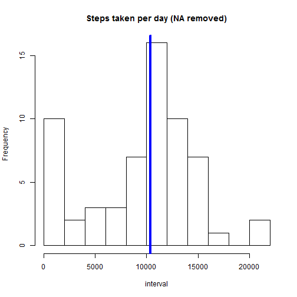
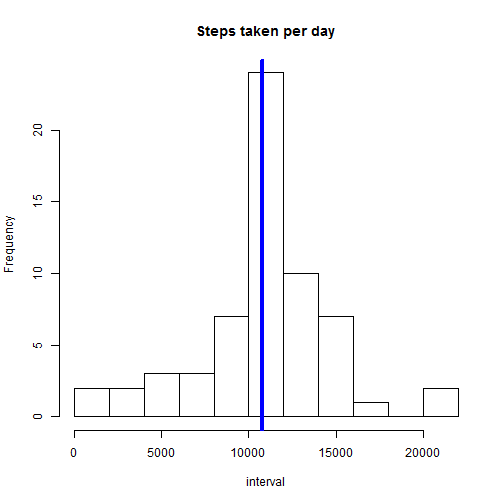
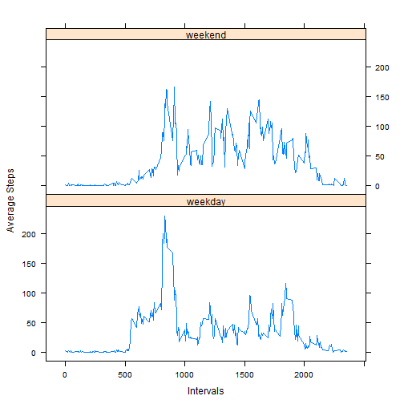

---
title: "Reproducible Research"
author: "Mandar Gujrathi"
date: "June 15, 2017"
output:
  word_document: default
  html_document: default
---


```r
knitr::opts_chunk$set(echo = TRUE)
```
## Load Data


```r
Act <- read.csv("dataactivity/activity.csv", sep = ",", header = TRUE)
```


## What is mean total number of steps taken per day?

For this part of the assignment, you can ignore the missing values in the dataset.

1. Calculate the total number of steps taken per day

2. If you do not understand the difference between a histogram and a barplot, research the difference between them. Make a histogram of the total number of steps taken each day


```r
mtot<- with(Act,tapply(steps,date,sum,na.rm=TRUE))
hist(mtot,10,main = "Steps taken per day (NA removed)", xlab = 'interval')
abline(v = median(mtot), col = 4, lwd = 4)
```



3. Report the Mean and Median of the total number of steps per day.


```r
message("The mean of the total number of steps per day is ", mean(mtot))
```

```
## The mean of the total number of steps per day is 9354.22950819672
```

```r
message("The median of the total number of steps per day is ", median(mtot))
```

```
## The median of the total number of steps per day is 10395
```

## What is the average daily activity pattern?

1. Make a time series plot (i.e. type = "l") of the 5-minute interval (x-axis) and the average number of steps taken, averaged across all days (y-axis)


```r
msteps<- with(Act,tapply(steps,interval,mean,na.rm=TRUE))
mstepsF <-as.data.frame(msteps)
mstepsF$int = rownames(mstepsF)
colnames(mstepsF) = c("AverageSteps", "interval")
with(mstepsF,plot(interval, AverageSteps, type = "l", xlab = "Interval", ylab = "Average Steps"))
```


2. Which 5-minute interval, on average across all the days in the dataset, contains the maximum number of steps?

```r
maxstp <- max(mstepsF$AverageSteps)
labmax <- which.max(mstepsF$AverageSteps)
message(" The interval which contains the maximum number of steps is ", names(labmax))
```

```
##  The interval which contains the maximum number of steps is 835
```

## Imputing missing values

Note that there are a number of days/intervals where there are missing values (coded as NA). The presence of missing days may introduce bias into some calculations or summaries of the data.

1. Calculate and report the total number of missing values in the dataset (i.e. the total number of rows with NAs)


```r
message("The total number of missing values is ", sum(is.na(Act)))
```

```
## The total number of missing values is 2304
```

2. Devise a strategy for filling in all of the missing values in the dataset. The strategy does not need to be sophisticated. For example, you could use the mean/median for that day, or the mean for that 5-minute interval, etc.

3. Create a new dataset that is equal to the original dataset but with the missing data filled in.


```r
Act1 <- Act
library(imputeTS)
Act1$steps<- na.replace(Act$steps,fill = msteps)
```

4. Make a histogram of the total number of steps taken each day and Calculate and report the mean and median total number of steps taken per day. Do these values differ from the estimates from the first part of the assignment? What is the impact of imputing missing data on the estimates of the total daily number of steps?


```r
mtot1<- with(Act1,tapply(steps,date,sum))
hist(mtot1,10,main = "Steps taken per day", xlab = 'interval')
abline(v = median(mtot1), col = 4, lwd = 4)
```



```r
message("The mean of the total number of steps per day is ", mean(mtot1))
```

```
## The mean of the total number of steps per day is 10766.1886792453
```

```r
message("The median of the total number of steps per day is ", median(mtot1))
```

```
## The median of the total number of steps per day is 10766.1886792453
```
# Comment: 
The mean and median values of the original data seem to be little different than the ones with the imputed data. It looks like the values have been shifted a bit. This is because the NA values are ignored in the first part of the assignments. These NA values are now filled in the second part and hence there are more values to average. 


## Are there differences in activity patterns between weekdays and weekends?

For this part the weekdays() function may be of some help here. Use the dataset with the filled-in missing values for this part.

Create a new factor variable in the dataset with two levels - "weekday" and "weekend" indicating whether a given date is a weekday or weekend day.


```r
Act1$weekday <- weekdays(as.Date(Act1$date))
Act1$day = "weekday"
wnd <- (Act1$weekday == "Saturday" | Act1$weekday == "Sunday")
Act1$day[wnd] = "weekend"
```


Make a panel plot containing a time series plot (i.e. type = "l") of the 5-minute interval (x-axis) and the average number of steps taken, averaged across all weekday days or weekend days (y-axis). 


```r
DayAvg <- with(Act1, tapply(steps,list(interval,day),mean))
DayAvgF <- as.data.frame(DayAvg)
DAF<- stack(DayAvgF)
DAF$int <- rep(as.numeric(rownames(DayAvg)),2)
colnames(DAF) = c("Average", "Day", "int")
library(lattice)
xyplot(Average~int |Day, data = DAF,type = "l", layout = c(1,2),xlab = "Intervals", ylab = "Average Steps")
```



# Comment:
There seem to be a difference in the plots between the weekend and weekday activities,

